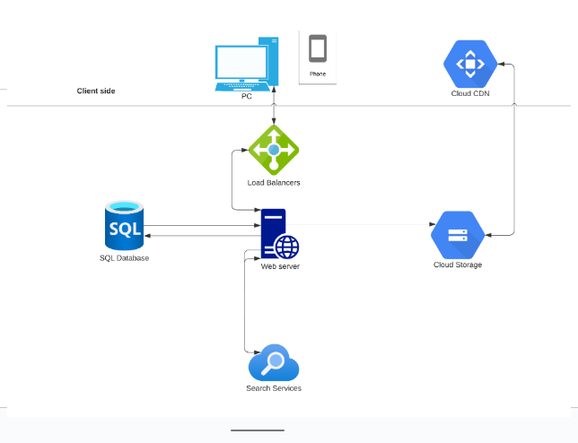

# Caravan Connect

# Introduction
Caravan Connect aims to address the challenge of connecting travelers who are driving to the same destination, enabling them to travel together and share a unique journey experience. It promotes safer travel, reduced costs, and the opportunity to build friendships along the way.

Caravan Connect will not handle bookings or reservations for accommodations, services, or activities during the journey. It focuses exclusively on connecting travelers.

- link to your deployed site - [local host](http://127.0.0.1:5500/)
- final project blog article - [Caravan Connect](https://www.linkedin.com/pulse/portfolio-project-anne-wachana)
- author(s) LinkedIn - [Linkedin](https://www.linkedin.com/in/anne-wachana-284aa8166/)

# Installation
Caravan Connect was installed using local host

# Usage
This project is relevant to any individuals or groups planning road trips or long-distance travel and seeking companions for a shared travel experience.

# Contributing

- Anne Wachana - [Github](https://github.com/a11y-2824)

# Related projects
### Carpooling Apps (e.g., UberPOOL, BlaBlaCar):
Similarities: Carpooling apps allow users to find others traveling on the same route and share rides to their destinations, promoting eco-friendly travel and cost-sharing.

Differences: Carpooling apps primarily focus on sharing private cars for daily commutes or long-distance travel. They do not specifically cater to the concept of caravanning, where a group of individuals travel together as a convoy, making planned stops and having a coordinated travel experience.

### Travel Forums and Groups (e.g., Reddit Travel Subreddits, Facebook Travel Groups):
Similarities: Travel forums and groups allow individuals to connect with like-minded travelers, share itineraries, and seek companions for trips.

Differences: These platforms facilitate discussions and connections among travelers but do not provide dedicated features for forming caravans or traveling together as a coordinated group.

### Travel Buddy Apps (e.g., Travello, Tourlina):
Similarities: Travel buddy apps aim to connect solo travelers seeking companionship during their trips.

Differences: These apps focus on finding travel buddies for specific trips rather than forming a cohesive caravan with coordinated travel plans and stops.

# Inspiration
- Caravan Connect aims to connect travelers who are driving to the same destination, enabling them to travel together and share a unique journey experience. 
- It promotes safer travel, reduced costs, and the opportunity to build friendships along the way.
- It was inspired by concept of caravanning, where a group of individuals travel together as a convoy, making planned stops and having a coordinated travel experience.

# Technoogy and Architecture

- This is an end-to-end map of the data flowing through the system. 
- The user enters the DNS using their phone or computer. 
- Here, there are different tabs that the user can click on and make a request. 
- The request will hit the load balancer to send the request to the web server. 
- The web server can then obtain the information from the database. 
- Alternatively, the request can be sent to the search service and processed. 
- All data, such as past trips and login information, will be recorded in the cloud storage, which can be retrieved when needed. 
- The processed request is sent back to the web server, the load balancer, and the user’s browser.

# Core algorithims
- Backend: Flask (Python) for building RESTful APIs and handling backend logic.
- Frontend: php and html for creating dynamic and interactive user interfaces.
- Database: MySQL for efficient data storage and retrieval.
- Hosting: Deployment on localhost.
- Version Control: Git for collaborative development and version control.

# Licensing
- Anne Wachana - [Github](https://github.com/a11y-2824)
- Joe Magolo - [Github](https://github.com/ETHreds)

# Web App Preview

