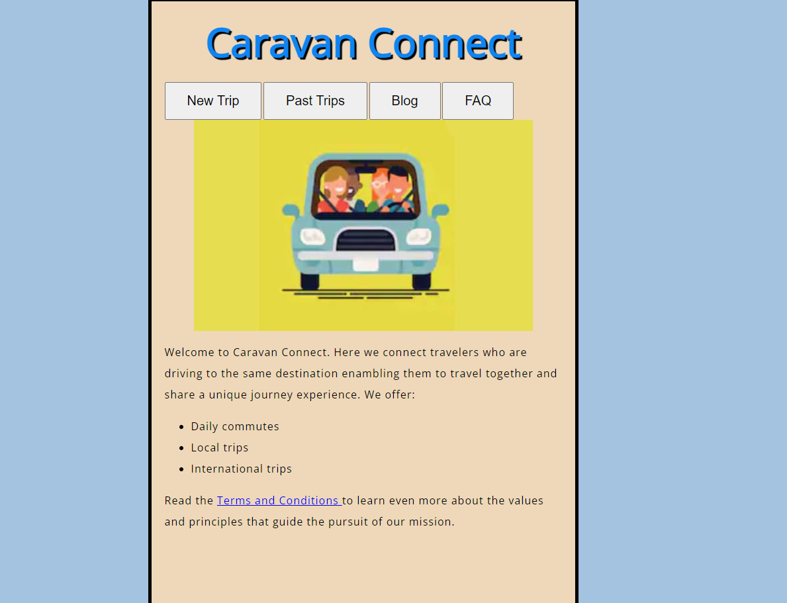

# Caravan Connect

Caravan Connect aims to address the challenge of connecting travelers who are driving to the same destination, enabling them to travel together and share a unique journey experience. It promotes safer travel, reduced costs, and the opportunity to build friendships along the way.

Caravan Connect will not handle bookings or reservations for accommodations, services, or activities during the journey. It focuses exclusively on connecting travelers.

This project is relevant to any individuals or groups planning road trips or long-distance travel and seeking companions for a shared travel experience.

# Collaborators 

- Joe Magolo - [Github](https://github.com/ETHreds)
- Anne Wachana - [Github](https://github.com/a11y-2824)

# Web App Preview

